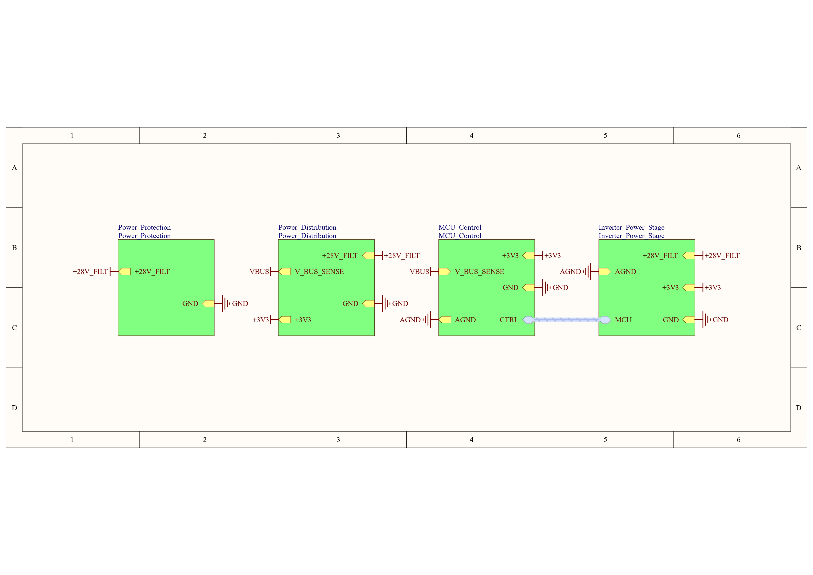
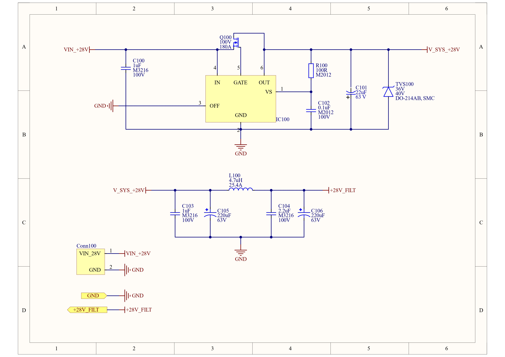
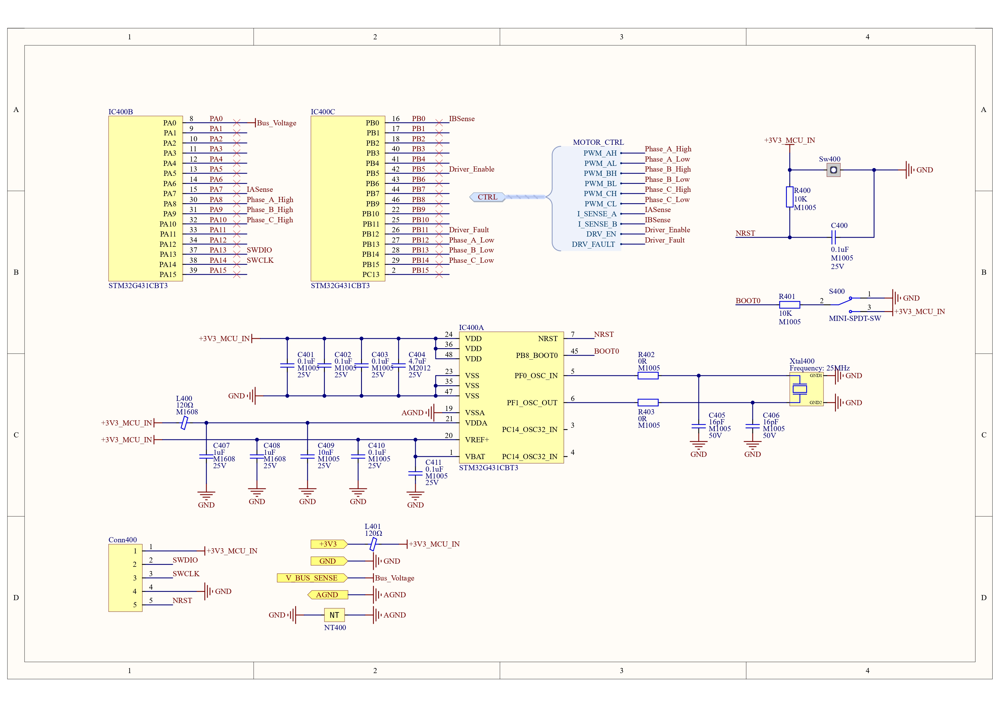
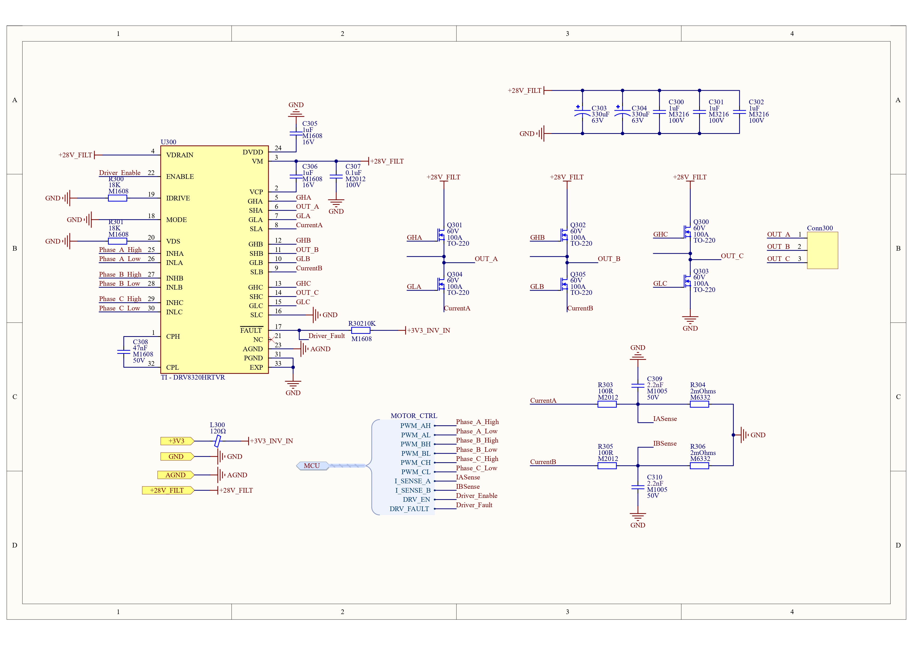

# 🚀 MIL-STD-461G Compliant 3-Phase BLDC Motor Driver

This project is a complete hardware design for a high-power, industrial/military-grade Brushless DC (BLDC) Motor Driver, engineered to operate under harsh environmental conditions and meet strict electromagnetic compatibility (EMI/EMC) requirements based on **MIL-STD-461G**. 

The system is designed to handle **28V and up to 30A of continuous/peak current**. It was built from scratch using Altium Designer with a **Strict Hierarchical** design methodology. The hardware design (Schematic & PCB Layout) is 100% complete, featuring advanced signal integrity, power isolation, high-current routing, and FOC (Field Oriented Control) hardware optimizations.

## 🌟 3D Hardware Showcase

| Isometric View 1 | Isometric View 2 | Top View |
|:---:|:---:|:---:|
|  |  |  |

---

## 🛠️ PCB Layout & Thermal Management

The PCB layout was meticulously routed to safely handle **30A of continuous phase current** while maintaining strict signal integrity for the analog front-end.

* **High-Current Polygons:** The Top and Bottom layers utilize massive polygon pours for the +28V input and phase outputs to minimize DC resistance and optimize thermal dissipation.
* **Component Placement:** The STM32G4 and sensitive analog traces are physically isolated from the high-voltage switching nodes of the DRV8320 and CSD18532KCS MOSFETs.
* **Via Stitching:** Extensive ground via stitching is implemented across the board to tie the return planes together, significantly reducing loop inductance and EMI emissions.

| Top Layer (Polygons Enabled) | Bottom Layer (Routing & Ground Planes) |
|:---:|:---:|
|  |  |

---

## 📐 System Architecture & Schematic Design

To maximize maintainability, signal integrity, and fault isolation, the system is divided into 4 main sub-blocks and 1 Top Sheet:

### 1. Main Sheet (Top Level)
The architectural backbone of the system. Power and signal buses (Harness & Bus) are securely routed between blocks. 
* **Design Decision:** Power net names (e.g., `+28V_FILT`, `+3V3`) were unified across all hierarchical sheets instead of using local names. This ensures continuous, unbroken copper polygon pours (Power Planes) during the PCB layout phase, minimizing track impedance.

### 2. Power Protection Stage
The system's first line of defense against electrical anomalies.
* **Ideal Diode Controller:** Instead of a standard power diode, an **LM5050MK-1** paired with an N-Channel MOSFET is used for reverse polarity protection. 
* **Hardware Detail:** The MOSFET is carefully oriented so its body diode blocks reverse current, preventing massive heat dissipation and voltage drops during 30A forward operation.

### 3. Power Distribution Stage
The layer where the 28V main bus voltage is stepped down in stages for the digital and analog logic units.
* **Thermal Distribution:** The regulation is split into a two-stage cascade: `28V -> 12V (LM5005)` and `12V -> 3.3V (TPS54302)`. This distributes the thermal load of the step-down (Buck) converters and prevents a single point of failure from overheating.

### 4. MCU Control (Digital Brain & Analog Front-End)
Powered by the **STM32G431CBT3**, explicitly chosen for its advanced motor control peripherals.
* **Two-Shunt FOC Architecture:** Instead of using external Current Sense Amplifiers (CSAs), the design leverages the STM32G4's hardware **OPAMPs in PGA (Programmable Gain Amplifier) mode**. Phase currents ($I_a$ and $I_b$) are routed directly to the MCU. The third phase current ($I_c$) is calculated in software using Kirchhoff's Current Law, saving BOM cost and board space while reducing signal latency.
* **LC Low-Pass Filtering:** A **Murata BLM Series Ferrite Bead** is placed sequentially before the MCU's 3.3V bypass capacitors. This isolates the MCU's sensitive analog and digital logic from the high-frequency switching noise generated by the 28V inverter stage.

### 5. Inverter Power Stage
The high-current, high-speed switching core of the driver.
* **Hardware:** Texas Instruments **DRV8320HRTVR** smart gate driver paired with **CSD18532KCS** (100A rated) power MOSFETs to easily handle 30A loads without thermal bottlenecking.
* **EMI Slew-Rate Control:** Although the DRV8320 is a smart driver, empty 0R pads for series **Gate Resistors** were implemented to allow manual tuning of the MOSFET turn-on/turn-off slew rates—a critical requirement for passing MIL-STD-461G radiated emissions tests.
* **RC Snubber Integration:** Direct capacitor connections to GND on the phase outputs were strictly avoided to prevent catastrophic shoot-through currents. Instead, footprints for **RC Snubbers** (Resistor + Capacitor in series) were placed to dampen voltage ringing and high-frequency emissions during switching transitions.

---

## ⚙️ Key Engineering Highlights

1. **Robust Thermal & Power Routing:**
   To safely handle 30A of continuous current, massive copper polygon pours are utilized for the +28V input and phase outputs. Extensive ground via stitching is implemented to tie the top and bottom return planes together, significantly reducing loop inductance and optimizing heat dissipation.
2. **Professional Block Numbering (Annotation):**
   All components are numbered sequentially by hierarchical block (e.g., Protection is the 100 series, Inverter is the 400 series) allowing engineers to instantly locate physical components on the PCB by looking at their designator.
3. **Zero-Error Design:**
   The strict hierarchical architecture and PCB layout were meticulously refined to resolve all design rule violations, resulting in perfectly clean ERC (Electrical Rule Check) and DRC (Design Rule Check) reports.

---

## 🚀 Future Work & Verification

* **LTspice Thermal & Switching Simulation:** Simulating the CSD18532KCS Half-Bridge switching characteristics to mathematically verify switching losses, conduction losses, and RC Snubber damping efficiency under 30A load.
* **Input Filter Inrush Simulation:** Modeling the initial power-on sequence to verify the LM5050MK-1 ideal diode controller's response and validate the input LC filter's damping performance.
